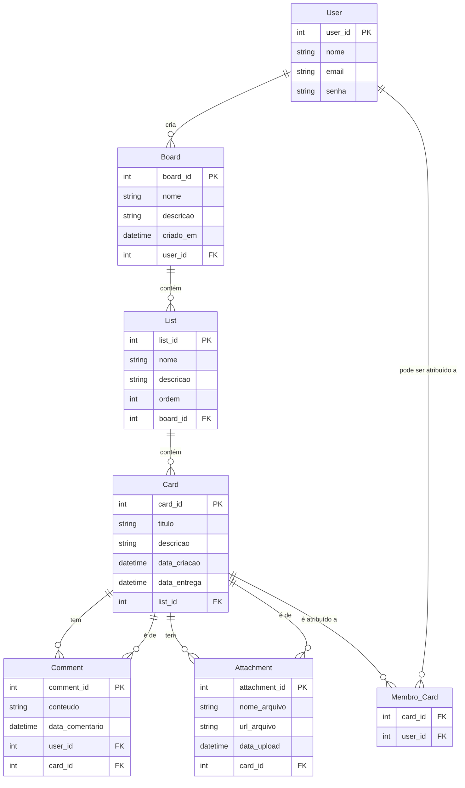

## UML

```mermaid
erDiagram
    User {
        int user_id PK
        string nome
        string email
        string senha
    }

    Board {
        int board_id PK
        string nome
        string descricao
        datetime criado_em
        int user_id FK
    }

    List {
        int list_id PK
        string nome
        string descricao
        int ordem
        int board_id FK
    }

    Card {
        int card_id PK
        string titulo
        string descricao
        datetime data_criacao
        datetime data_entrega
        int list_id FK
    }

    Membro_Card {
        int card_id FK
        int user_id FK
    }

    Comment {
        int comment_id PK
        string conteudo
        datetime data_comentario
        int user_id FK
        int card_id FK
    }

    Attachment {
        int attachment_id PK
        string nome_arquivo
        string url_arquivo
        datetime data_upload
        int card_id FK
    }

    User ||--o{ Board : "cria"
    Board ||--o{ List : "contém"
    List ||--o{ Card : "contém"
    Card ||--o{ Comment : "tem"
    Card ||--o{ Attachment : "tem"
    Card ||--o{ Membro_Card : "é atribuído a"
    User ||--o{ Membro_Card : "pode ser atribuído a"
    Comment }o--|| Card : "é de"
    Attachment }o--|| Card : "é de"

```
